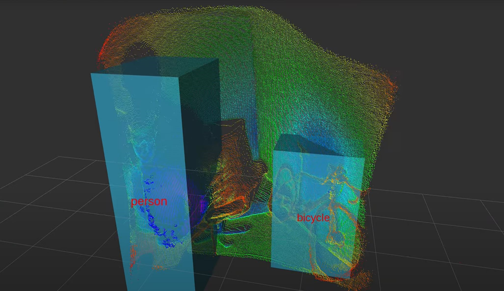
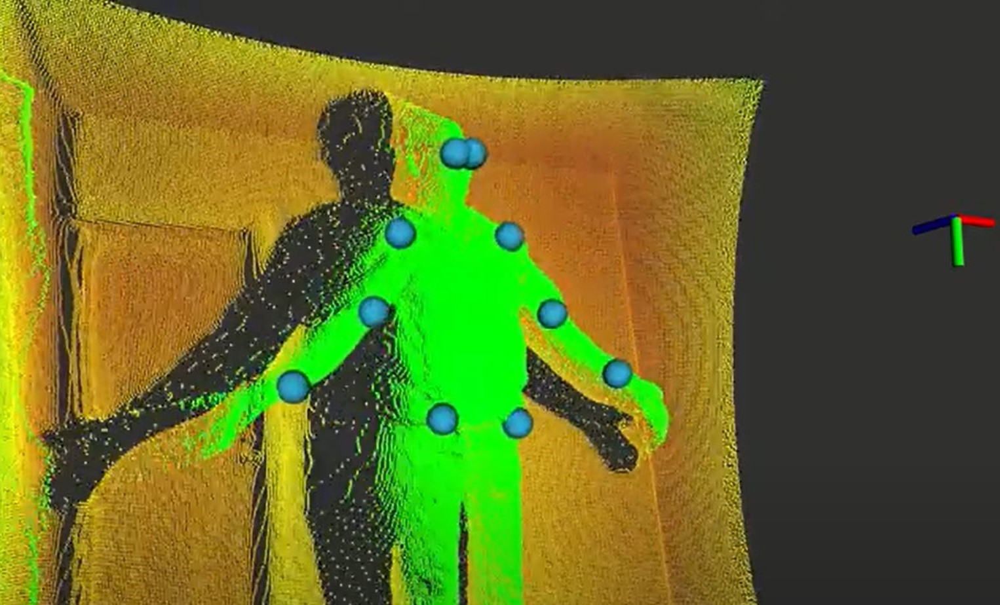
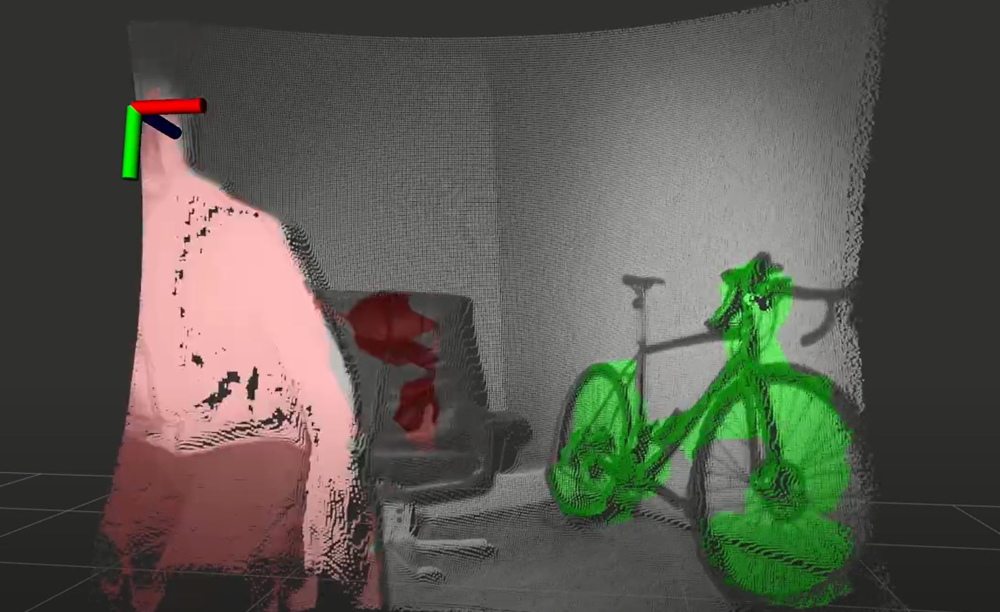

# Nimbus-Perception
Nimbus-Perception is a ROS based perception stack for the Nimbus3D time-of-flight camera.
The deep learning (tensorflow) based algorithms are running on embedded systems liek a Raspberry Pi4 (64bit Raspberry OS) at ~10Hz. You need to install OpenCV 4.2 and and tensorflow light as well as ROS noetic (perception or desktop-full). The install scripts are given in the "scripts" folder. A 64bit OS is highly reccomended as it will reduce the runtime to about the half.
A prepared Raspberry OS 64bit image can found [here](https://cloud.pieye.org/index.php/s/nimbus3D).

## Nimbus-Detection
Nimbus-Detection is 3D object detection based on a [MobileNets: Efficient Convolutional Neural Networks for Mobile Vision Applications](https://arxiv.org/pdf/1704.04861.pdf). This implementation can detect 91 different classes as shown in the COCO_labels.txt. Every detected object will have an estimated 3D postion and size. The bounding box and class will be visualized in RVIZ.

```
roslaunch nimbus_detection nimbus_detection.launch
```



## Nimbus-Pose
Nimbus-Pose is a 3D human pose estimation which extracts the keypoints of the human body. It is based on posenet [PersonLab: Person Pose Estimation and Instance Segmentation with a Bottom-Up, Part-Based, Geometric Embedding Model](https://arxiv.org/pdf/1803.08225.pdf). This implementation can extract all keypoints of a single person and estimate the 3D sceleton.
```
roslaunch nimbus_pose nimbus_pose.launch
```



## Nimbus-Segmentation
Nimbus-Segmentation is a semantic pointcloud segmentation based on [DeepLab: Semantic Image Segmentation with Deep Convolutional Nets, Atrous Convolution, and Fully Connected CRFs](https://arxiv.org/pdf/1606.00915.pdf). It assigns one of 21 classes to every 3d point and publishes the colourized pointcloud.
```
roslaunch nimbus_segmentation nimbus_segmentation.launch
```


